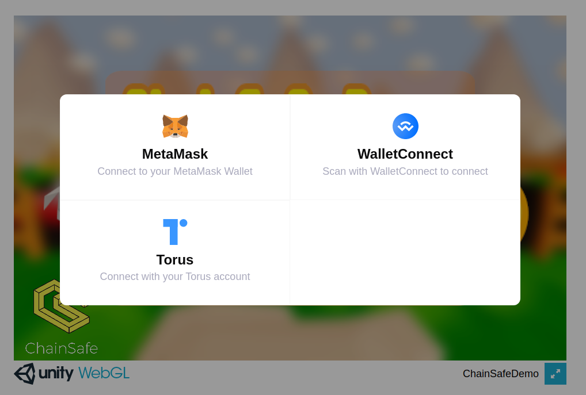

# Demo Unity Web3 Game with ChainSafe SDK

## Introduction

A simple demo to show a web3 game, developed with [chainSafe SDK for Unity](https://github.com/ChainSafe/web3.unity).

## Technology Stack & Tools

- [Unity](https://unity.com/)
- [Web3](https://en.wikipedia.org/wiki/Web3)
- [C#](https://learn.microsoft.com/es-es/dotnet/csharp/)
- [ChainSafe SDK for Unity](https://github.com/ChainSafe/web3.unity)

## Requirements For Initial Setup

- [Unity Hub](https://unity.com/download)
- [Docker](https://docs.docker.com/engine/install/)
- [Docker-compose](https://docs.docker.com/compose/)

## Setting Up

### 1. Clone/Download the Repository
  
  `$ git clone repo_url`

### 2. Open in Unity
  
  - Open folder in Unity (tested in Unity Editor **2021.3.18f1**).
  - Build or Build and Run!.

### 3. Run Release

1. Download release from [here](https://github.com/dappsar/unity-web3-chainsafe-demo/releases/download/v1.0.0/release-v1.0.0.zip)

2. Unzip release in root folder:

3. Execute this command to build container wtih script:

    `$ ./build.sh -n web3-demo -p8120 -d .`

    Notes: 
      - _web3-demo_: It is the container name.
      - _'.'_: It indicates the sub-folder within the 'Builds' folder that contains the build files. Assumes the files are in the root of builds folder.

     
    Another option, use docker-compose: 
    
    `$ docker-compose up -d`

4. Open browser in: http://localhost:8120

---

## References

- [ChainSafe Web3 Unity SDK](https://docs.gaming.chainsafe.io/)
- [Unity Engine + MetaMask Wallet](https://medium.com/coinmonks/unity-engine-metamask-wallet-6797d4699e45)
- [Chainsafe Gaming SDK - Making Blockchain Games Plug & Play](https://www.youtube.com/watch?v=qa2TatYgvYs)
- [ChainSafe Registration Project Site](https://dashboard.gaming.chainsafe.io/)
- [Goerli Faucet](https://goerli-faucet.pk910.de/)

----

## Credits 

- [Original Repo and credits](https://github.com/ChainSafe/ChainSafe-Demo-WebGLProject-Files)

